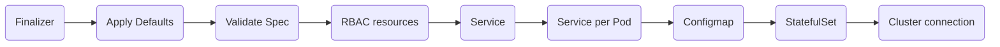

# Hazelcast Platform Operator Architecture

Hazelcast Platform Operator consists of controllers and [Custom Resources](https://kubernetes.io/docs/concepts/extend-kubernetes/api-extension/custom-resources/). Controllers' main operation is to reconcile between the Custom Resource specifications and real world state. Following are the Custom Resources Hazelcast Platform Operator manages:

- [Hazelcast](#hazelcast-custom-resource)
    - [HotBackup](#hotbackup-custom-resource)
- [ManagementCenter](#managementcenter-custom-resource)

## Hazelcast Custom Resource

You can create Hazelcast clusters using the Hazelcast Custom Resource. The operator supports both open source and enterprise clusters. Hazelcast Custom Resource's main logic lies in the `controllers/hazelcast/hazelcast_controller.go`. In the reconciliation logic, at every step operator ensures the state is healthy before continuing with the following step. 

Above is the flowchart for the Hazelcast cluster reconciliation logic. Explanation for every step is as follows:

- **Finalizer:** This step deals with finalizer addition and deletion when resource gets created or is tagged to be deleted. The reason for finalizer is for managing lifecycle of cluster scoped resources that is created for namespace scoped Hazelcast Custom Resource.
- **Apply Defaults:** OpenAPIV3 schema allows to define default values for the Hazelcast `spec` field but it does not add default values when `spec` field is empty. In this step, we add default values for the Hazelcast Custom Resource when they are not present.
- **Validation:** OpenAPIV3 schema has validation support but its validation support is limited. Here, operator validates if the Hazelcast Custom Resource is created/updated correctly.
- **RBAC Resources:** Hazelcast members need RBAC permissions to be able to find each other. Here, we create ClusterRole, ClusterRoleBinding and ServiceAccount for Hazelcast pods.
- **Service:** Operator creates the service for Hazelcast member discovery.
- **Service per Pod:** If `exposeExternally` is enabled, operator creates a service for every Hazelcast member. It makes sure the services are ready before continuing with the following steps.
- **ConfigMap:** It creates the ConfigMap for Hazelcast member configuration. The ConfigMap is the mounted into each Hazelcast member.
- **StatefulSet:** It creates the StatefulSet for Hazelcast members and ensures they are all running before continuining with the next step.
- **Cluster connection:** Creates a Hazelcast Go Client which connects to the cluster. Then, it updates the Hazelcast Custom Resource's `status` field.

### HotBackup Custom Resource

You can create Hot backups for Hazelcast resources using HotBackup Custom Resource. When HotBackup Custom Resource is created with a Hazelcast Custom Resource in its `spec`, operator will create a hot backup from the mentioned Hazelcast cluster. Its main logic lies inside the file `controllers/hazelcast/hot_backup_controller.go`.

Above is the flowchart for the HotBackup reconciliation logic. Explanation for every step is as follows:

- **Get Hazelcast CR:** Ensures that there is a Hazelcast Custom Resource with the given name and it is in `ready` state.
- **Client Creation:** Create an HTTP client for accessing the Hazelcast REST API.
- **Passive State:** Change Hazelcast cluster state to `PASSIVE`.
- **Take Hot Backup:** Take hot backup of the cluster. Hot Backup preperation is synchronous and it continues asynchronously. 
- **Active State:** Change the cluster state to active after the hot backup REST call is finished.

## ManagementCenter Custom Resource

You can create Management Center instances to monitor Hazelcast clusters you have created. ManagementCenter Custom Resource's main logic lies in the file `controllers/managementcenter/managementcenter_controller.go`

Above is the flowchart for the ManagementCenter reconciliation logic. Explanation for every step is as follows:

- **Finalizer:** This step deals with finalizer addition and deletion when resource gets created or is tagged to be deleted. 
- **Apply Defaults:** OpenAPIV3 schema allows to define default values for the ManagementCenter `spec` field but it does not add default values when `spec` field is empty. In this step, we add default values for the ManagementCenter Custom Resource.
- **RBAC Resources:** This step is only applies to Openshift clusters. Operator creates Role, RoleBinding and ServiceAccount for allowing pods use user IDs they want.
- **Service:** This step creates the service for exposing Management Center instance.
- **StatefulSet:** It creates the StatefulSet for Management Center and ensures it is ready.
